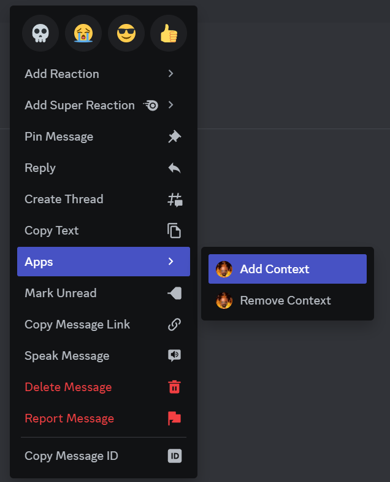
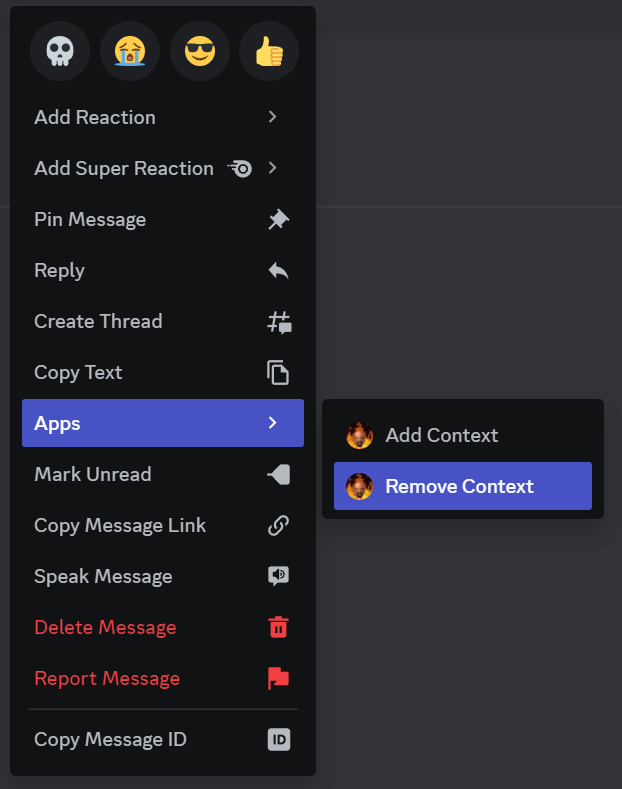
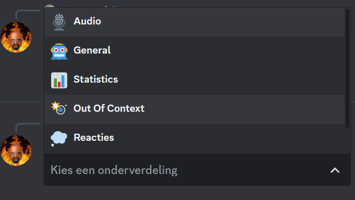

## Commands

### Audio

#### /soundboard

Plays the chosen sound effect in voice chat. Costs 5 nwords to use.

#### /tts

Plays a chosen text-to-speech message in voice chat in a chosen voice. Costs 5 nwords to use.

#### /play

Plays the audio of a YouTube or Spotify track/playlist in voice chat.

#### /list

List the tracks that are in the queue.

#### /nowplaying

Display the currently playing track.

#### /pause

Pause the currently playing audio.

#### /resume

Resume the paused audio.

#### /loop

Toggle the loop function. Played tracks will get added back into the queue.

#### /skip

Skip a variable number of tracks.

#### /stop

Stops playing audio & clears the queue.

#### /join

Joins the voice chat.

#### /leave

Leaves the voice chat.

### General

#### /help

Displays a help embed with help for every command

#### /lien

Triggers the Lien lockdown. This kicks grom.

#### /ping

Checks if the bot is alive.

#### /say

Says anything the user wants to say.

#### /embed

Says anything the user wants to say, but in an embed.

#### /countdown

Displays the countdown till a given moment in time.

#### /dm

The bot anonymously dm's a chosen user with a chosen message. Costs 3 nwords to use.

#### /chat

Chat with the bot using AI technology. Costs 3 nwords to use.

#### /image

Let the bot create an image using your imagination. Costs 5 nwords to use.

#### /invite

Sends an invite to the main server.

#### /remindme

Set a reminder.

### Out Of Context

#### /context_debug

Shows some stats about the Out Of Context game

#### /play_game

Play the Out Of Context game

#### Add Context

Adds an Out Of Context message to the game.

On pc, right click on a message, choose apps, and click on 'Add Context'

On mobile, long click on a message, choose apps, and click on 'Add Context'

#### Remove Context

Removes an Out Of Context message to the game.

On pc, right click on a message, choose apps, and click on 'Remove Context'

On mobile, long click on a message, choose apps, and click on 'Remove Context'

### Owner

#### /sync

Syncs commands.

#### /load_cog

Load a cog.

#### /unload_cog

Unload a cog.

#### /reload_cog

Reload a cog.

#### /cogs

Displays a list of loaded cogs.

#### /restart

Restarts the bot.

#### /blacklist_show

Shows a list of all blacklisted users.

#### /blacklist_add

Add a user to the blacklist.

#### /blacklist_remove

Remove a user from the blacklist.

### Reacties

#### /wholesquadlaughing

Costs 1 nwords to use.

#### /notfunny

Costs 1 nwords to use.

#### /uthought

Costs 1 nwords to use.

#### /golden_rule

Costs 2 nwords to use.

#### /laten_doen

Costs 2 nwords to use.

#### /limieten

Costs 2 nwords to use.

#### /danny

Costs 2 nwords to use.

#### /bozo

Costs 2 nwords to use.

#### /gible

Costs 2 nwords to use.

#### /nootje

Costs 2 nwords to use.

#### /pingy

Costs 2 nwords to use.

#### /ba

Costs 2 nwords to use.

#### /meng

Costs 2 nwords to use.

#### /broodman

Costs 2 nwords to use.

#### /keleo

Costs 2 nwords to use.

### Stats

#### /stats_individual

See how many times a user has used a command.

#### /changecommandcount

Change the command count of a user.

#### /leaderboard

Displays the top 10 users of a command

Choose which subdivision your command is in first, and then choose your command.

#### /bancount

Displays the amount of times a user has been banned.

#### /changebancount

Change the ban count of a user.

#### /ncount

Displays the amount of times a user has said the nword.

#### /changencount

Change the nword count of a user.

## System variables

* application_id
* autounban
* channel
* countdown
* countdown_title
* DATABASE_URL
* grom
* guild_id
* openaisecret
* owners
* permissions
* spotify_client_id
* spotify_client_secret
* time_delay
* token
* uberduckapi
* uberducksecret
* yt_api
* yachja

## Requirements / Technologies used

* discord.py
* psycopg2
* yt_dlp
* PyNaCl==1.4.0
* ffmpeg
* aiohttp>=3.7.4
* requests
* pytube
* openai
* dateparser
* reactionmenu
* StringProgressBar
* spotipy
* google-api-python-client

Also thanks to [kkrypt0n](https://github.com/kkrypt0nn/Python-Discord-Bot-Template) for providing a very helpful template.
